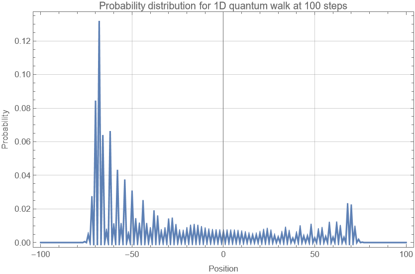
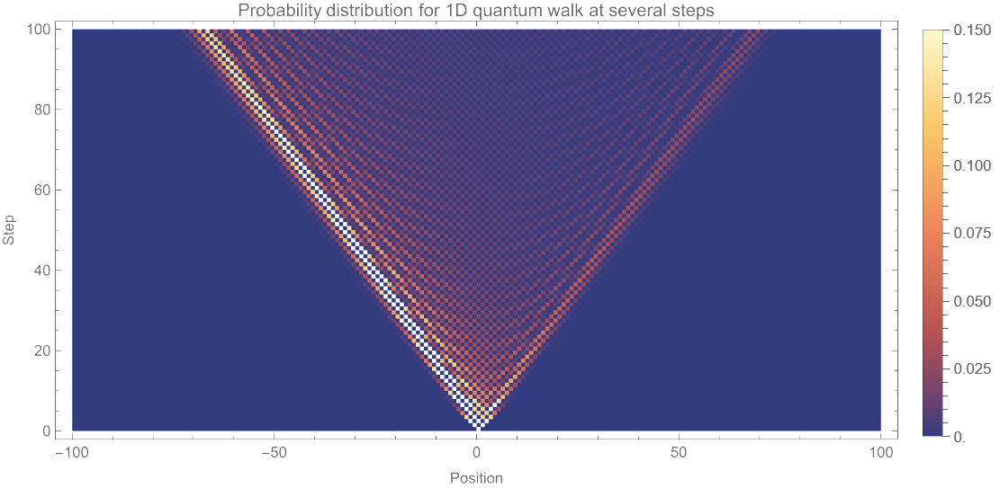
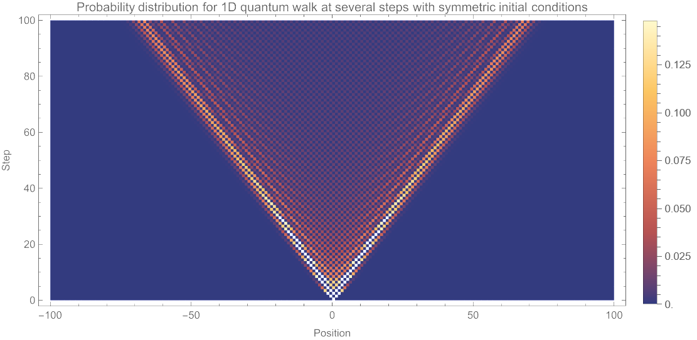
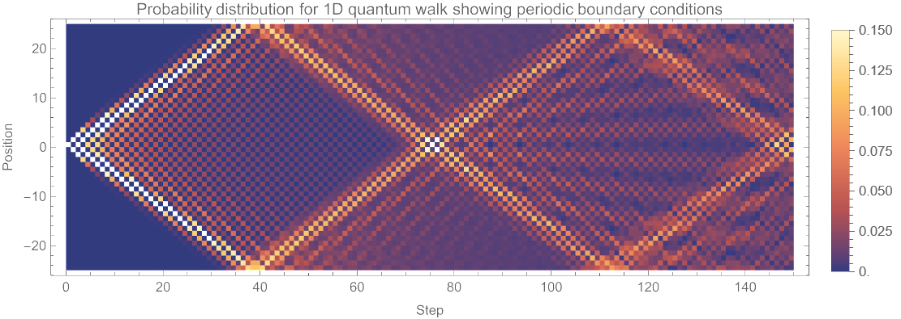
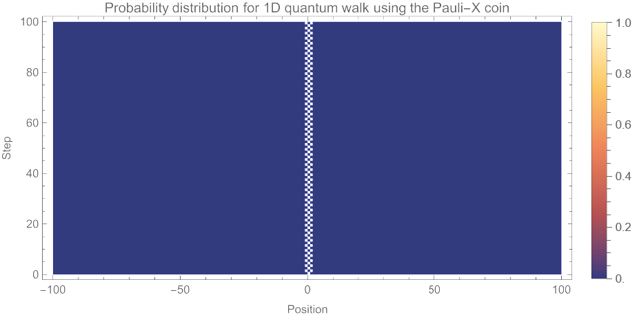
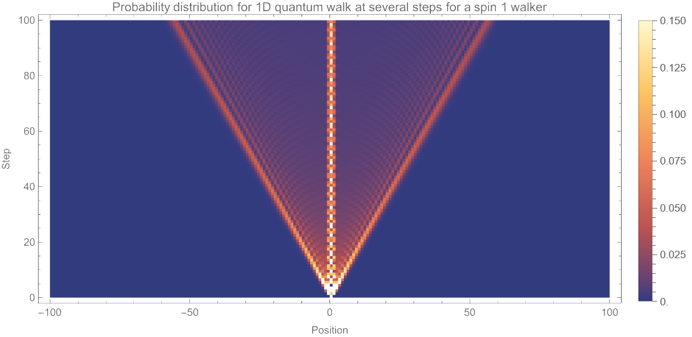

# Quantum Walks

This repository contains a set of Mathematica (Wolfram Language) simulations on discrete-time quantum walks in 1D. All code, explanations, and outputs are included in a single notebook organized into six independent sections ("Simulation 1"-"Simulation 6").

Author: Enrique Arroyo Moro. MIT License (see LICENSE). Citation: see CITATION.cff.

---

## Contents

The notebook is structured as follows:

1. **Simulation 1: Probability distribution for a 1D quantum walk at 100 steps**  
   Baseline discrete-time walk for a spin-1/2 walker on a 1D lattice using the Hadamard coin and a conditional shift. Plots the probability distribution after a fixed number of steps.

2. **Simulation 2: Animated probability distribution for a 1D quantum walk**  
   Animation of the probability distribution over time steps (same model as Simulation 1).

3. **Simulation 3: Animated probability distribution with symmetric initial conditions**  
   Shows how the initial coin (spin) state affects symmetry/asymmetry of the distribution, including a phase choice that yields a symmetric walk.

4. **Simulation 4: Periodic boundary conditions**  
   Verifies periodic (wrap-around) boundary conditions by using a smaller lattice and inspecting probability near the edges.

5. **Simulation 5: Different coins**  
   Compares the walk under different coin operators: Hadamard, Identity, and Pauli-X.

6. **Simulation 6: 1D quantum walk for a spin-1 walker**  
   Extends the walk to a three-level (spin-1) coin space and uses the Grover coin. The shift rule is generalized so that \|−1⟩ moves left, \|+1⟩ moves right, and \|0⟩ stays in place.

---

## How to run

1. Open the Mathematica notebook (`.nb`) in Wolfram Mathematica.
2. Each simulation is self-contained. Run a single simulation by evaluating its cells/section.
3. Parameters such as lattice size `n` and number of steps are defined within each simulation section and can be modified at the beginning of that section.

---

## Results (selected)

Each simulation includes its own outputs (plots and/or animations) directly in the notebook.

### Simulation 1 - Probability distribution at 100 steps

### Simulation 2 - Distribution over all steps

### Simulation 3 - Symmetric initial conditions

### Simulation 4 - Periodic boundary conditions

### Simulation 5 - Different coins
Pauli-X (flip) coin:

Identity coin:

### Simulation 6 - Spin-1 walk (Grover coin)

---

## Citation

If you use this repository (code, figures, or results), please cite it (e.g., in the acknowledgements or references) and link to the repository.

---

## References

[1] J. Kempe, “Quantum random walks – an introductory overview,” arXiv:quant-ph/0303081. https://arxiv.org/abs/quant-ph/0303081

[2] L. K. Grover, “A fast quantum mechanical algorithm for database search,” STOC ’96. DOI: 10.1145/237814.237866. Preprint: arXiv:quant-ph/9605043. https://arxiv.org/abs/quant-ph/9605043

[3] A. Saha, D. Saha, and A. Chakrabarti, “Discrete-time Quantum Walks in Qudit Systems,” arXiv:2207.04319. https://arxiv.org/abs/2207.04319

---
